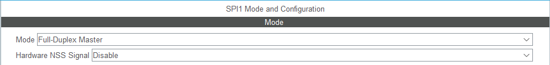

## Gimbal based on the ST Microelectronics Discovery board ##

### The problem ###

The design consists of a control firmware for a positioning system based on three small servomotors (SG92R), an inertial measurement unit (IMU GY-91), a laser module (SYD-1230) and a control board based on the ARM Cortex-M4 processor (STM32F4 Discovery).

The fimware inside the Discovery board acquires the inertial parameters from the IMU GY-91, according to the inclination (X,Y,Z), acts on each servo motor to correct the drift, keeping the projected cross at a fixed point.

The gimbal consists of three joints, driven by three servomotors. The test consists of capturing the initial position of the gimbal and keeping the projected cross in the same position despite disturbances in the base, which will be done manually.

### Block Diagram and Pinout ###

The servomotors, whose angle is controlled by a PWM signal, and the IMU, which communicates via SPI, are connected to the Discovery board. The laser is kept on during the entire test.

Each PWM signal is generated by the pins of port D associated to three channels of Timer 4 of the STM32F407VGT.
Since communication with GY-91 is via SPI bus, these signals are connected to Port A.

FreeRTOS is used to create one thread per joint which will move according to the scheduler task management.

Pin A4 has been modified for the IMU SPI chip select.

The rest of the SPI bus signals are as shown in the table below.

The assignment of the timer 4 channels to the pins of Port D is shown below.

### Configuring Timer 4 to generate PWM signals ###

Selection of channels for PWM signals to control the motors from timer 4.

The frequency of the PWM signal is 50 Hz, which implies a period of 20 ms. The duty cycle varies from 1 ms for 0 degrees, to 2 ms for 180 degrees, so, to position the servomotor at 90 degrees, we need a duty cycle with 1.5 ms.

To set the duty cycle of the PWM signal we use the CCRx registers, which will increase or decrease its value according to the difference between the instantaneous position and the target position. The ARR register will be used to set the frequency of the PWM signal.

As the selected clock source is 16 MHz we will need to divide this by 40 (Prescaler) to get a timer frequency of 400 KHz, which gives us a period count of 2500 ns. To get a 20 ms period in the PWM signal we need 8000 counts of 2500 ns in the Timer, this is the value of the ARR register.

ARR = 8000 for 20 ms period

The maximum and minimum duty cycles were obtained, for setting 180 and 0 degrees.

|Cycle|degrees|CCRx|
|---|---|---|
|0.8ms|0| 320|
|1.5ms | 90 | 600|
|2.2ms | 180 | 800|

The clock source is configured, selecting the internal oscillator that generates 16 MHz.

### Configuring IMU communication ###

Full-Duplex Master mode default configuration.

### RTOS configuration ###

Created a task to control the motor of each joint Shoulder, Elbow and Wrist.

Also created a task to get the data (pitch, roll, yaw) from the IMU and put them in the queues (X,Y,Z).

Each joint controls each of the position axes.

Shoulder is the motor at the base, acting on the Z-axis (yaw).

Elbow is the next motor in the chain, acting on the Y-axis (pitch).

Wrist is the motor acting on the block containing the laser and the IMU, it acts on the X-axis (roll).

